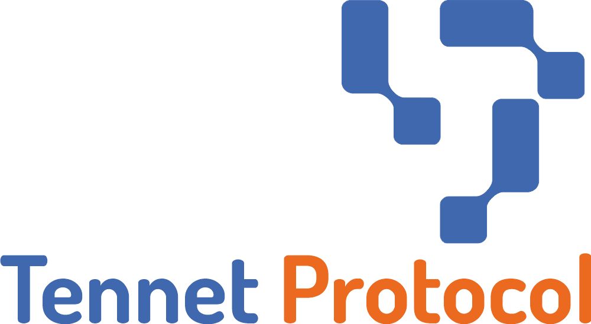
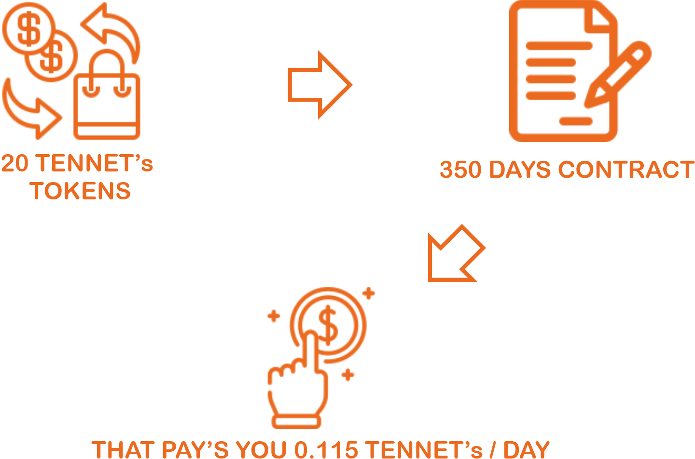

# Tennet Whitepapper English

<figure><figcaption></figcaption></figure>

## **WHAT IS TENNET PROTOCOL**

Tennet is a passive income protocol, with a different view from the Defi (decentralized finance) protocols present in the market. We are a very small Brazilian team that, with our own resources, decided to make this different vision of Defi available to the community, focused on conscious passive income.

## **VISION AND OBJECTIVES**

With a conscious vision and a lot of planning, our goal is to offer a Defi option focused on passive income, where you can achieve long-term and consistent returns.

All our planning, from choosing the network where we will work, to the way in which the whitelists, airdrops, anti-whaling mechanisms will be made, everything is thought of in the stability of the project's currency, in the constant growth and so that everyone can participate in a passive income protocol.

## **PASSIVE INCOME PROTOCOL**

You participate by buying 20 of our tokens, enter the Dapp from the official website and click on “Sign Contract” and that's it. Daily you will be able to redeem just over 0.5%, that is, 0.115 Tennet Tokens\* for a period of 350 days. At the end of the period, you will have received 200% of your contract plus the Tennet Token appreciation. _\*\*\* THE INCOME OF 0.5% PER DAY MAY CHANGE ACCORDING TO THE NEED OF THE PROTOCOL. \*\*\*_

Based on studies, market research and simulations of accessions and daily payments, we arrived at this method that provides longevity and stability of the project's token.

<figure><figcaption></figcaption></figure>

## **DISTRIBUTION OF TOKENS & TOKENOMICS**

The initial plan is to work with the distribution of tokens as shown in the chart below, as long as all Whitelist and Pre-sale tokens are sold. If this does not happen, these values will be changed and informed here in the official project documentation.

<figure><figcaption></figcaption></figure>

| Nome         | **Tennet Token** |
| ------------ | ---------------- |
| Symbol       | **TENNET**       |
| Total supply | **1.000.000**    |
| Blockchain   | BSC              |
| Dex          | Pancake Swap     |

## **FEES**

12% will be charged on claim rewards. The team's portfolio (6%) provides for the payment of professionals involved with the project. The marketing portfolio (3%) is intended to pay for any type of marketing, campaigns, partnerships with promoters, etc. The treasury portfolio (3%), the possible destinations will be decided with the community: buyback, investment in other projects, investment in Defis, purchase and hold of a currency with great potential, etc...

All development, hosting, contract creation costs, etc. are being borne by the team itself, as well as marketing and partnership costs. As the project does not allocate tokens for staff or marketing, these will be paid throughout the project and the better the project, the more resources we will have for marketing and the more resources we will have for the treasure wallet. In this way, we created a mechanism where there will be no eviction of large amounts of coins from the project and so we will not have sudden variations in the price of the Tennet Token.

<figure><figcaption></figcaption></figure>

## **AIRDROPS, PRE-SALE**

Airdrop: 1% supply for airdrops and giveaways – 10,000 tokens. These will be drawn to social media followers, marketing campaigns and will be aimed at engagement, dissemination, partnerships and project growth.

Pre-sale: 80,000 tokens, 8%. We will do an open pre-sale, where anyone can participate, with a maximum of 100 tokens per participant. _\*\*\* THESE VALUES MAY CHANGE ACCORDING TO THE NEED OF THE PROJECT \*\*\*_

## **ROADMAP**

|         |                                                                                                                                                                                            |
| ------- | ------------------------------------------------------------------------------------------------------------------------------------------------------------------------------------------ |
| DONE    | Market research – Analysis of passive income projects with cryptos                                                                                                                         |
| DONE    | Development of the Simulation System – We developed a system that simulates the adhesion of contracts, payments and the value of the Tennet Token for the parameterization of the contract |
| DONE    | Website Development and Publication                                                                                                                                                        |
| DONE    | Social Media                                                                                                                                                                               |
| WORKING | Simulations – Run simulations based on data collected from market research                                                                                                                 |
| WORKING | Tennet Token Contract                                                                                                                                                                      |
| WORKING | Tennet Protocol Contract                                                                                                                                                                   |
| WORKING | Dapp                                                                                                                                                                                       |
| WORKING | Growth of social networks - partnerships, make the Tennet Protocol known                                                                                                                   |
| WORKING | Airdrops                                                                                                                                                                                   |
| TBA     | Listing Coingecko, Coinmarketcap                                                                                                                                                           |
| TBA     | Whitelist                                                                                                                                                                                  |
| TBA     | Pre-sale                                                                                                                                                                                   |
| TBA     | LAUNCH                                                                                                                                                                                     |

## **OFFICIAL LINKS**

<table><thead><tr><th></th><th></th><th data-hidden></th><th data-hidden></th></tr></thead><tbody><tr><td>Site</td><td><a href="https://tennetprotocol.com">https://tennetprotocol.com</a></td><td></td><td></td></tr><tr><td>Instagram</td><td><a href="https://instagram.com/tennetprotocol">https://instagram.com/tennetprotocol</a></td><td></td><td></td></tr><tr><td>Twitter</td><td><a href="https://twitter.com/tennetprotocol">https://twitter.com/tennetprotocol</a></td><td></td><td></td></tr><tr><td>Discord</td><td><a href="https://discord.gg/MXBbaaKqQC">https://discord.gg/MXBbaaKqQC</a></td><td></td><td></td></tr><tr><td>Telegram Channel</td><td><a href="https://t.me/tennetprotocolchannel">https://t.me/tennetprotocolchannel</a></td><td></td><td></td></tr><tr><td>Telegram Group PT</td><td><a href="https://t.me/tennetprotocolpt">https://t.me/tennetprotocolpt</a></td><td></td><td></td></tr><tr><td>Telegram Group EN</td><td><a href="https://t.me/tennetprotocolen">https://t.me/tennetprotocolen</a></td><td></td><td></td></tr></tbody></table>

## **LEGAL NOTICE**

Cryptocurrencies have the potential for great rewards, they may not be suitable for all investors. Before deciding to trade any cryptocurrency or DeFi protocol, you should carefully consider your investment objectives, experience level and risk. Daily reward rate is not guaranteed. The information provided does not constitute investment advice, financial advice, business advice or any other type of advice, and you must not treat any whitepaper or website content as such. Tennet Protocol will not accept liability for any loss or damage, including, without limitation, any loss of profit, which may arise directly or indirectly from the use of or reliance on such information.
